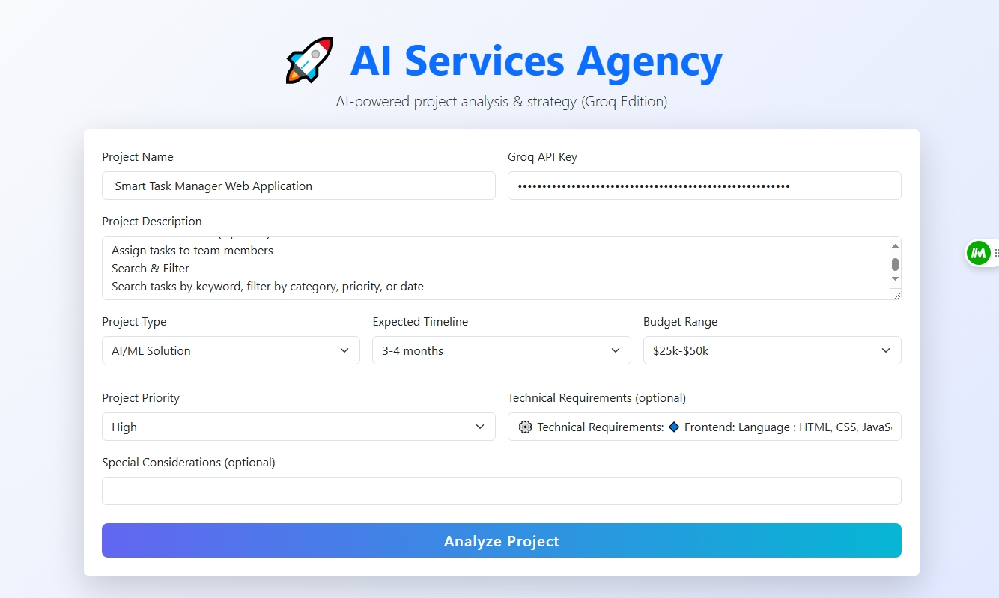

# 🚀 AI Services Agency (Groq Edition)

A full-service digital agency powered by CrewAI agents and Groq LLMs. Analyze, plan, and strategize software projects with a beautiful modern frontend and robust Flask backend.

---

## 🌟 Features

- **Five Specialized AI Agents:**
  - **CEO Agent:** Strategic leader, project feasibility, and business alignment.
  - **CTO Agent:** Technical architecture, feasibility, and system design.
  - **Product Manager Agent:** Product vision, roadmap, and go-to-market.
  - **Developer Agent:** Technical implementation, tech stack, and effort estimation.
  - **Client Success Agent:** Client engagement, communication, and customer success.

- **Custom Tools:**
  - `AnalyzeProjectRequirements` for structured project analysis.
  - `CreateTechnicalSpecification` for technical assessment.

- **Modern UI/UX:**
  - Responsive, beautiful frontend (Bootstrap, custom CSS).
  - Tabbed results for each agent's output.
  - Real-time feedback and error handling.

- **Asynchronous, Multi-Agent Collaboration:**
  - Parallel and sequential agent workflows.
  - Real-time, non-blocking communication between agents.

- **Easy Deployment:**
  - Flask backend, static frontend, Docker, Gunicorn, and Nginx ready.

---

## 🏁 Quickstart & Deployment

### Local Development

1. **Create a virtual environment (optional but recommended):**
   ```powershell
   python -m venv venv
   .\venv\Scripts\Activate
   ```
2. **Install dependencies:**
   ```powershell
   pip install -r requirements.txt
   ```
3. **Run the Flask app:**
   ```powershell
   python app.py
   ```
4. **Open the Frontend:**
   - Visit [http://localhost:5000](http://localhost:5000) in your browser.

### Production Deployment

- **Gunicorn:**
  ```powershell
  pip install gunicorn
  gunicorn app:app --bind 0.0.0.0:8000 --workers 4
  ```
- **Docker:**
  ```powershell
  docker build -t crewai-agency .
  docker run -d -p 8000:8000 crewai-agency
  ```
- **Nginx:**
  - See `DEPLOYMENT.md` for a sample config.

---

## ⚙️ Environment Variables
- The Groq API key is provided via the frontend form for each request.
- For persistent keys, set `GROQ_API_KEY` in your environment or use a `.env` file (with `python-dotenv`).

---

## 🖥️ Folder Structure
```
CREWAI_SERVICE_AGENCY/
├── app.py
├── crewai_app.py
├── backend/
│   ├── agents/
│   │   └── agents.py
│   ├── llms/
│   │   └── llm.py
│   └── tools/
├── frontend/
│   ├── index.html
│   ├── styles.css
│   └── app.js
├── requirements.txt
├── Dockerfile
├── Procfile
├── DEPLOYMENT.md
├── README.md
└── ...
```

---

## 🧑‍💻 How It Works

1. **User submits project details and Groq API key via the frontend.**
2. **Flask backend** orchestrates CrewAI agents:
   - CEO → CTO → Product Manager → Developer → Client Success
3. **Each agent** analyzes, plans, or strategizes using LLMs and custom tools.
4. **Results** are displayed in beautiful, interactive tabs on the frontend.

---

## 📸 Demo



---

## 🛡️ Notes & Best Practices
- Never commit your API keys.
- Use HTTPS in production (Nginx + Let's Encrypt).
- For scaling, use a process manager (systemd, supervisor, etc.) for Gunicorn.
- For more, see `DEPLOYMENT.md`.

---

## 📝 License
MIT License. See [LICENSE](LICENSE) for details.

---

**Built with [CrewAI](https://github.com/joaomdmoura/crewAI), [Groq](https://console.groq.com/), Flask, and ❤️.**